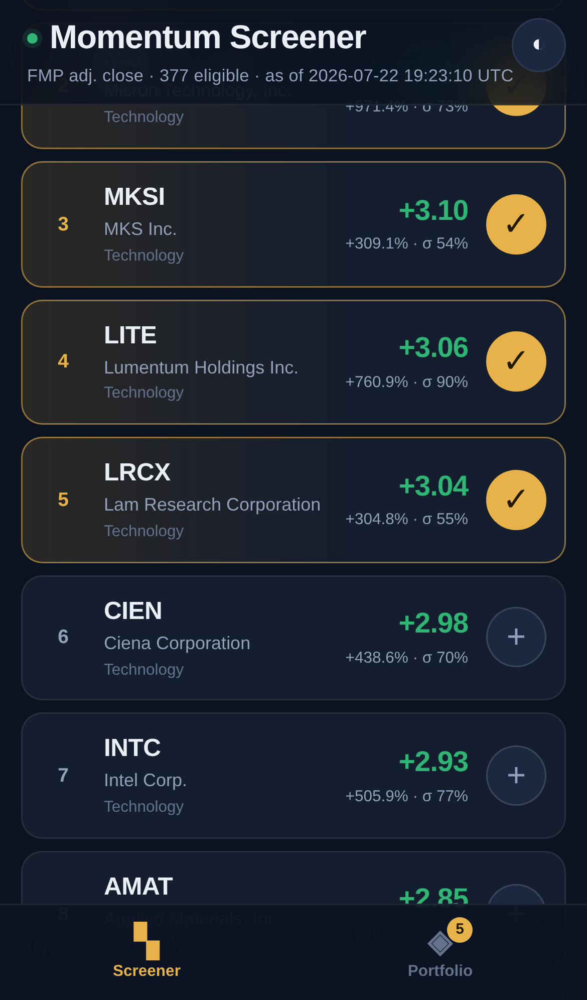
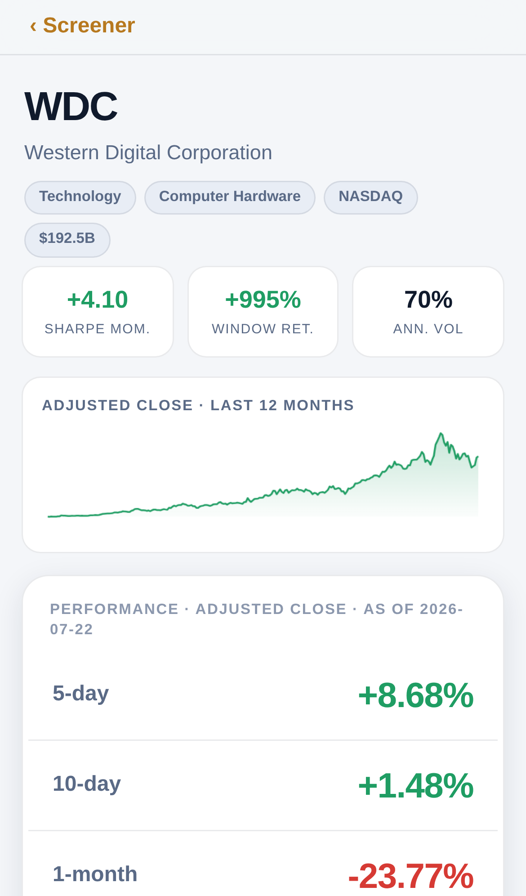
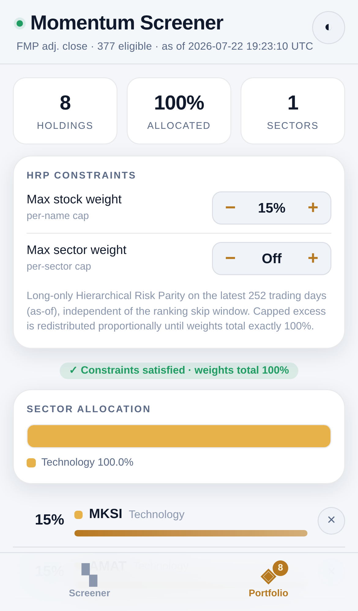

# Sharpe Momentum Screener

An iPhone-first Claude Artifact for ranking equities by **Sharpe momentum** and
building **long-only Hierarchical Risk Parity (HRP)** portfolios with optional
weight constraints. Three vertically-scrolling views — Screener, Portfolio, and
Ticker Detail — with no horizontal tables.

## Two ways to run it

**1. Native iPhone app (Expo Go) — recommended.** A React Native app in [`app/`](app/)
runs in Expo Go with native feel: haptics on select/tab, an SVG sparkline,
safe-area insets, and system light/dark. Install **Expo Go** from the App Store,
open the **Snack** link, and tap *Open in Expo Go*.

The Snack is generated with `python3 build/save_snack.py`:

- **Default (auto-updating).** Because the repo is public, the Snack references
  the app's raw GitHub files by URL, so the link is short, permanent, and
  refreshes on every push — nothing to re-share when data is rebuilt.
- **`--inline` (frozen).** Bakes the code + snapshot into a self-contained Snack
  that needs no external hosting (use if the repo is private).

**2. Static HTML artifact.** [`dist/portfolio-screener.html`](dist/portfolio-screener.html)
— a single self-contained file. Open it in mobile Safari, or publish it as a
Claude Artifact ([`dist/artifact-body.html`](dist/artifact-body.html) is the
body-only variant). Viewing it draws zero model usage — it is a static page.

Both share the **same validated math**: `app/engine.js` is auto-generated from the
HTML template's numerics (`build/make_engine.mjs`) and cross-checked against the
NumPy reference, so the app and the artifact can never drift.

<p>
  
  
  
</p>

## Why a build-time data layer (and where the API key lives)

Claude Artifacts run inside a sandboxed iframe with a strict Content-Security
Policy that **blocks every outbound network request** — no `fetch`, no CDN, no
API calls at runtime. The Financial Modeling Prep (FMP) key must also never
appear in browser code.

Both constraints point to the same design: a **build-time data layer**.

```
FMP stable API  ──►  build/fetch_data.py  ──►  data/snapshot.json  ──►  build/build_artifact.py  ──►  dist/portfolio-screener.html
   (key from                (fetch,               (compact,                (inject snapshot,              (self-contained;
    $API_KEY)                filter, dedup)         no key)                  verify no key/URL)             no key, no network)
```

- The key is read from the `API_KEY` environment variable **only at build
  time**, inside this coding environment. It is never written to any file that
  ships.
- `build_artifact.py` asserts the delivered HTML contains neither the key nor a
  live `financialmodelingprep.com` URL, and fails the build otherwise.
- The artifact embeds a compact JSON snapshot (adjusted daily closes + company
  metadata) with a **freshness timestamp** shown in the header. All ranking,
  HRP, and constraint math runs client-side on that snapshot.

Caching, retries (exponential backoff), and freshness stamping all live in the
fetch layer.

## Market data (FMP stable API)

Legacy FMP `/api/v3` endpoints are retired for current keys, so the pipeline
uses the **stable** API:

| Endpoint | Use |
| --- | --- |
| `/stable/company-screener` | Rule-based universe candidate discovery |
| `/stable/profile` | Company name, sector, industry, market cap, exchange, eligibility flags |
| `/stable/historical-price-eod/dividend-adjusted` | Split + dividend adjusted closes (`adjClose`) |

The current snapshot holds **520 trading days** for **377 eligible tickers**
(~1.3 MB), which covers the default 252-day ranking lookback with room to slide
the as-of date, the 252-day HRP risk window, and the 1-year detail return.

## Universe — US Top 500

`build/fetch_data.py` builds the universe, kept separate from all ranking and
portfolio logic: it pulls ~2,100 candidates (≥ $2B) across NYSE / Nasdaq / AMEX,
cleans them, and retains the **largest 500 eligible companies** by market cap.

- Actively traded common stocks; **ADRs and foreign listings allowed** (TSM, ARM, BABA, HSBC, …).
- Excludes ETFs, funds, non-common share classes (warrants/rights/units/preferreds
  via symbol pattern), SPACs/shells, invalid price or market cap, and stale /
  insufficient / erroneous histories (a > 80% single-day move is treated as bad data).
- Deduplicates share classes by issuer CIK, keeping the **most liquid** class
  (BRK-B over BRK-A, GOOGL over GOOG). Every drop is recorded in `snapshot.exclusions`.

The Top 500 pool also carries **per-sector sub-universes** (Technology, Financials,
Healthcare, …) as tags — the horizontal pill selector switches between them with no
extra data. To use fixed constituent lists or different rules instead, edit the
screener query in `discover_candidates()`.

## Security eligibility (every exclusion recorded)

Retains active common equities on major US exchanges (NASDAQ / NYSE / AMEX).
Excludes ETFs, funds, non-common share classes (warrants / rights / units /
preferreds / foreign listings, via a plain `^[A-Z]{1,5}$` symbol test that also
enforces **one primary share class per company**), SPAC shells, inactive
listings, invalid price histories, and duplicate securities (deduped by CIK,
keeping the largest listing). Every drop is logged with its reason in
`snapshot.exclusions`.

## The math

**Sharpe momentum** — simple daily returns from adjusted closes over the window
`[as_of − start_offset … as_of − end_offset]` (default 252 → 21, ≈ 231 returns):

```
annualized return     = mean(r) × 252
annualized volatility = sampleStd(r) × √252          (ddof = 1)
Sharpe momentum       = annualized return / annualized volatility     (rf = 0)
```

Ranked descending; scores and ranks recompute immediately whenever the window,
universe, or search changes. The screener shows rank, ticker, company, sector,
Sharpe momentum, cumulative return, and annualized volatility.

**HRP** — standard long-only Hierarchical Risk Parity on the **latest 252
trading days** (as-of), independent of the ranking skip window: stabilized
correlations → distance `√((1−ρ)/2)` → **average-linkage** (UPGMA) clustering →
quasi-diagonalization → recursive inverse-variance bisection.

**Constraints** — optional per-stock and per-sector maximum weights. Capped
excess is redistributed proportionally across remaining names until weights
total **exactly 100%**. Infeasible caps (e.g. `cap × count < 100%`) are refused
with an explanation of what to change rather than silently violated.

## Ticker detail

Reproduces the compact performance card: an as-of timestamp and adjusted-close
returns for 5-day, 10-day, 1-month, 3-month, 6-month, and 1-year periods (YTD
excluded), green for gains and red for losses, large touch-friendly type, plus a
12-month sparkline.

## Rebuilding the snapshot

```bash
export API_KEY=<your FMP key>        # read at build time only; never shipped
python3 build/fetch_data.py          # -> data/snapshot.json (+ exclusions)
python3 build/build_artifact.py      # -> dist/portfolio-screener.html (artifact)
node    build/make_engine.mjs        # -> app/engine.js (shared numerics)
cp data/snapshot.json app/snapshot.json
python3 build/save_snack.py          # -> new Snack URL (prints it) for the Expo app
```

To refresh market data in the Expo app, re-run the above and share the new
Snack URL (an anonymous Snack is immutable, so refreshing data mints a new link).
The FMP key never appears in the snapshot, the artifact, or the Snack.

## Verification

```bash
python3 build/reference_numerics.py  # NumPy reference: formulas, HRP, constraints
python3 build/dump_expected.py       # dump reference outputs
node    build/validate_js.mjs        # shipped JS == Python reference (109 checks)
node    build/verify_edge.mjs        # boundaries, HRP stability, exact 100%, perf (1058 checks)
node    build/smoke_test.mjs         # headless iPhone render + screenshots
```

The JS numerics that ship in the artifact are extracted verbatim from
`build/template.html` and cross-checked against the NumPy reference, so the two
implementations cannot drift. Performance: ranking a 500-ticker universe takes
~3 ms per pass and HRP on 50 names ~15 ms.
